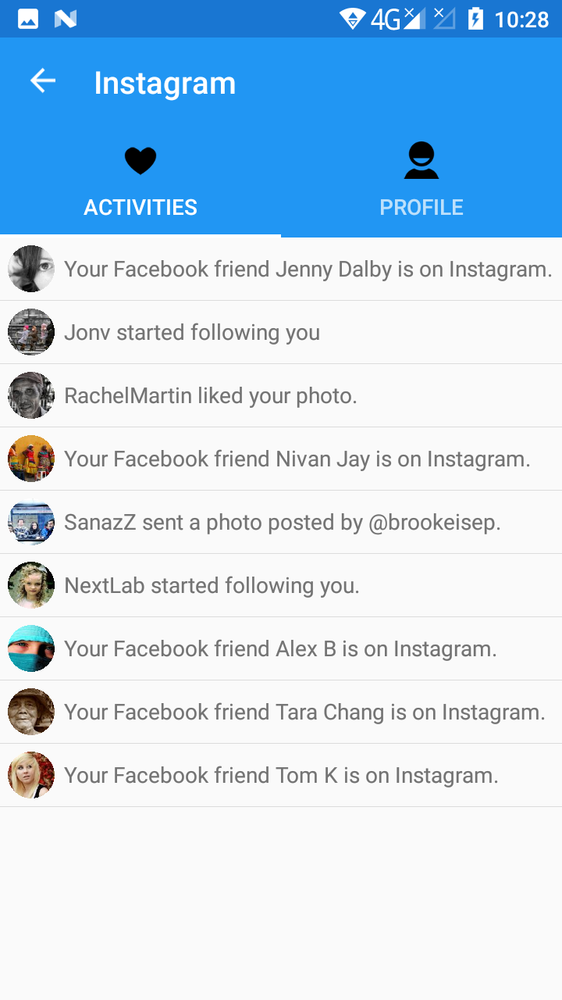
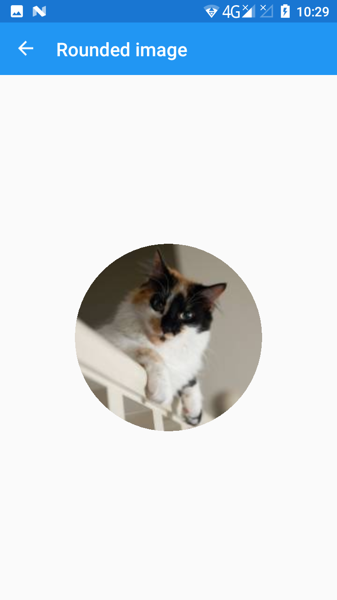
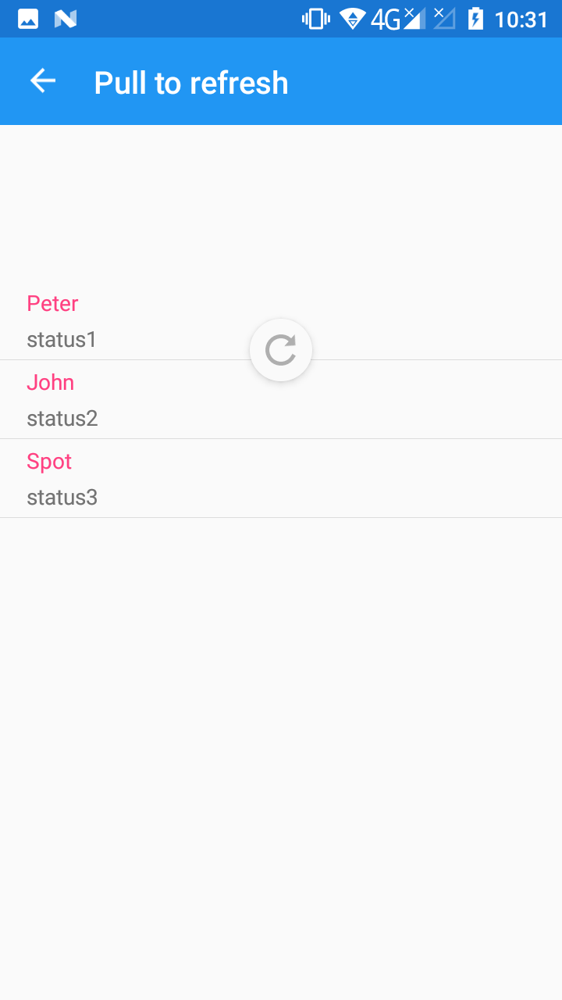
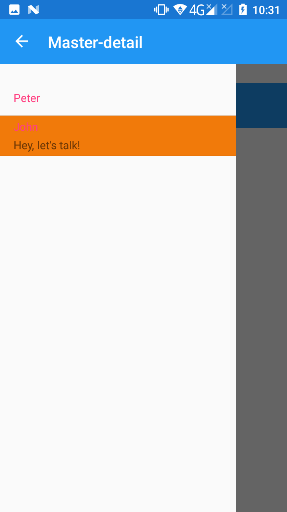

# HelloXamarin
I built this demo project while I was learning Xamarin Forms. It's full of Xamarin Forms samples/examples.

Visual Studio 2015, .NET Framework 4.5, Xamarin Forms 4.0.30319

Supported platforms: Android, IOS, Windows 8.1 Desktop & Phone

## Android screenshots

## WinPhone screenshots

